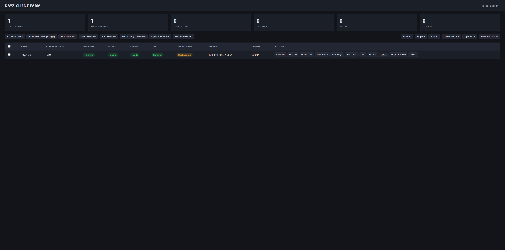

# Game Client Farm Management System

Runs multiple legitimate game clients simultaneously on Windows 11 — each in its own VM, with its
own Steam account and its own Steam session — for private server QA, load testing, and controlled
client/server automation. Both the **hypervisor backend** (Hyper-V or VMware Workstation) and the
**game itself** are pluggable:

- **Hypervisor**: **Hyper-V** (default, see docs/MASTER-IMAGE.md) or **VMware Workstation** (see
  docs/VMWARE-SETUP.md) — pick exactly one per host (they're mutually exclusive in practice on a
  single machine).
- **Game**: selected by the Agent's `GameId` config (see docs/ARCHITECTURE.md's "Game modules"
  section). **DayZ** is the first, reference implementation — supporting another game means
  writing a new `IGameLauncher`/`IGameStatusProvider` module, not reworking the Controller,
  dashboard, or VM lifecycle, none of which know or care which game is running.



**This project does not, and will never, bypass Steam, bypass BattlEye, bypass licensing, or
emulate a Steam client.** Every client VM runs a real Steam client logged into a real,
legitimate Steam account that owns DayZ.

## Project structure

```
GameFarm.slnx
src/
  GameFarm.Shared/      Agent wire protocol (OS-agnostic)
  GameFarm.Core/        Domain models, config, interfaces, pure logic (naming, batching, backoff)
  GameFarm.HyperV/      IVirtualMachineProvider implementation (Hyper-V via PowerShell)
  GameFarm.VMware/      IVirtualMachineProvider implementation (VMware Workstation via vmrun.exe)
  GameFarm.Controller/  ASP.NET Core host: REST API, SignalR, dashboard, SQLite, secrets
  GameFarm.Agent/       Per-VM Scheduled Task (interactive session): Steam/game process management,
                        watchdog, plus Games/&lt;name&gt;/ per game module (DayZ is the first/reference one)
scripts/                Install-Agent (hypervisor-agnostic), Tools/Show-AgentToken
  Hyper-V/              Hyper-V-only: Install-Host, Create-Master, Create-Client(s), Create-SteamLibraryDisk,
                        Remove-Client, Start/Stop-Client, Configure-Network, Common, Tools/ (GPU-P scripts)
  VMware/               VMware Workstation-only (vmrun.exe): Install-Host, New-MasterSnapshot, Create-Client(s),
                        Remove-Client, Start/Stop-Client, Configure-Network (read-only), Common
config/                 appsettings.example.json
docs/                   INSTALL, ARCHITECTURE, MASTER-IMAGE, VMWARE-SETUP, STEAM-SETUP, PLUGINS,
                        AGENT-UPDATES, TROUBLESHOOTING
tests/GameFarm.Tests/   xUnit tests (no Hyper-V or VMware Workstation required)
```

## Requirements

- Windows 11 **(only Pro / Enterprise / Education if using the Hyper-V backend — Home does not
  support Hyper-V at all. VMware Workstation has no such edition restriction and runs on Home
  too.)**
- .NET 9 or .NET 10 SDK
- PowerShell 7+ (Windows PowerShell 5.1 works as a fallback)
- One legitimate Steam account per client, owning DayZ (App ID 221100)
- **Hyper-V only:** no extra install — it's a built-in Windows feature, enabled by
  `scripts\Hyper-V\Install-Host.ps1`.
- **VMware Workstation only:** VMware Workstation Pro or Player installed separately (not
  included) — see docs/VMWARE-SETUP.md.

## Build

```bash
dotnet build GameFarm.slnx
dotnet test GameFarm.slnx
```

## How to enable Hyper-V / prepare the host

```powershell
.\scripts\Hyper-V\Install-Host.ps1 -RootDirectory D:\GameFarm -VirtualSwitchName GameFarmSwitch
```

Never reboots automatically — if Hyper-V needs enabling it tells you to reboot and re-run.

> **Using VMware Workstation instead?** Skip Hyper-V entirely — the two are mutually exclusive
> in practice on one host (see docs/VMWARE-SETUP.md). Run
> `.\scripts\VMware\Install-Host.ps1 -RootDirectory D:\GameFarm` instead: it checks `vmrun.exe`
> is installed, warns if Hyper-V is still enabled, and creates the same directory layout. Then
> set `"Hypervisor": "VMwareWorkstation"` in `appsettings.json` (see
> `config/appsettings.example.json`) and skip straight to docs/VMWARE-SETUP.md.

## Create the first master VM

```powershell
.\scripts\Hyper-V\Create-Master.ps1 -CpuCount 4 -MemoryGB 6 -IsoPath C:\ISOs\Win11.iso
```

Then follow the manual Windows/Steam/DayZ/agent install steps in docs/MASTER-IMAGE.md. The
master's Steam is **never** logged into a personal account.

By default this also creates a second disk (`SteamLibrary-Master.vhdx`) that you install Steam +
DayZ into directly — every client then gets its own tiny differencing disk straight against that
one real file instead of a full ~40GB+ install each (see docs/MASTER-IMAGE.md). Pass
`-SkipSteamLibraryDisk` to opt out and install Steam/DayZ onto the OS disk as normal instead.

> **VMware Workstation:** there's no scripted equivalent to this one step — `vmrun` has no
> "create a new VM" command, so the master is always built through VMware Workstation's own
> **File → New Virtual Machine** wizard (docs/VMWARE-SETUP.md, step 3). Once Windows/Steam/DayZ/
> the Agent are installed and the VM is shut down cleanly, take the snapshot every client links
> against with `.\scripts\VMware\New-MasterSnapshot.ps1 -MasterVmx <path> -SnapshotName Baseline`.

## Create DayZ-001

```powershell
.\scripts\Hyper-V\Create-Client.ps1 -Name DayZ-001 -CpuCount 4 -MemoryGB 6 -Start
```

Or from the Controller once it's running: `POST /api/clients` with the client's name, VM name,
and target server.

> **VMware Workstation:**
> ```powershell
> .\scripts\VMware\Create-Client.ps1 -Name DayZ-001 -MasterVmx "D:\path\to\Master.vmx" -CpuCount 4 -MemoryGB 6 -Start
> ```
> Same linked-clone/`.vmx`-edit sequence the dashboard's Create Client uses behind the scenes —
> see docs/VMWARE-SETUP.md.

## Install the guest agent

```powershell
dotnet publish src/GameFarm.Agent -c Release -o C:\GameFarmAgent
```

Copy the publish output into the client VM, run `GameFarm.Agent.exe` once (generates its token),
then install it with `scripts/Install-Agent.ps1`:

```powershell
.\Install-Agent.ps1 -UserName Dayz-Master
```

This registers the agent as a **Scheduled Task** that runs directly in that account's
interactive logon session (and configures Windows auto-logon for it, so the VM boots straight
into that session) — **not** a LocalSystem Windows Service. That distinction matters: BattlEye
was found to consistently kick a session launched via a Session-0 service's
CreateProcessAsUser-based workaround ("Bad Packet"/"Game restart required"), since its
anti-tamper checks distrust a game process descending from a privileged service using a
duplicated security token — the same pattern real cheat-injection tooling uses. Running the
agent as a normal interactive process avoids that pattern entirely; see
docs/TROUBLESHOOTING.md. `-UserName` should be the same Windows account you log Steam into for
this VM (see docs/STEAM-SETUP.md below) — the whole point is for the agent to run in that same
session.

Do this once in the master image before creating client differencing disks, so every client
inherits the agent already installed.

> This step is identical regardless of hypervisor — the Agent runs inside the guest OS and has
> no idea (and no need to know) whether it's on a Hyper-V differencing disk or a VMware linked
> clone. Same command, same script, on either master.

## Log Steam into a client VM

Manual, once per VM — see docs/STEAM-SETUP.md. Steam Guard cannot be automated without either
storing credentials insecurely or bypassing Steam, both of which are out of scope. Also identical
regardless of hypervisor — nothing about Steam login depends on which one created the VM.

## Start the controller

```bash
dotnet run --project src/GameFarm.Controller
```

Dashboard: the URL Kestrel reports on startup (typically `http://localhost:5000`). Same command
either way — which hypervisor backend it drives is decided entirely by the `Hypervisor` setting
in `appsettings.json`, not by anything at startup.

## Configure the DayZ server target

Either per-client via `POST /api/clients` (`serverAddress`/`serverPort`), or edit an existing
client's record. The controller builds `-connect=<address> -port=<port>` (and `-password=` if a
secret is configured) via `DayZLaunchArgumentBuilder` and sends it to that client's agent, which
launches DayZ through Steam's own `-applaunch 221100 ...` mechanism. Identical regardless of
hypervisor — this all happens over the agent protocol, not through the VM provider.

## Dashboard usage

- **+ Create Client** / **+ Create Clients (Range)**: create one client, or a numbered range
  (`DayZ-001`, `DayZ-002`, ...) in one form — the same dashboard form regardless of which
  hypervisor is active, and the dashboard equivalent of `scripts/Hyper-V/Create-Client(s).ps1`
  or `scripts/VMware/Create-Client(s).ps1`, whichever backend is configured. Each still needs its
  Steam account logged in manually afterward (docs/STEAM-SETUP.md).
- Row actions: Start/Stop/Restart VM, Start/Stop/Restart DayZ/Steam, Join, Update, Details,
  **Register Token** (paste the agent's DPAPI-protected token after its first run in that VM),
  **Delete** (permanently removes the VM, disk, and client record — confirmation required).
- **Agent column** distinguishes three states that all otherwise look like "not responding":
  **Off** (VM isn't running), **Awaiting Token** (VM running, agent never registered — the
  expected state for a freshly created client until you hit Register Token), and
  **Unreachable** (token registered but the agent still isn't answering — a real problem; see
  docs/TROUBLESHOOTING.md).
- Bulk actions (select rows first): Start/Stop/Join/Restart DayZ/Update/Reboot Selected.
- Global actions (confirmation required): Start/Stop/Join/Disconnect/Update/Restart DayZ All.
- Client detail page (`/detail.html?id=<id>`): full status fields, all per-client actions, an
  **Edit Client** form (Steam account label, target server, RequiredMods, auto-start/reconnect/
  update flags), a **Mods** panel, and a **Logs** panel (DayZ log tail + action log tail).
- Live updates arrive via SignalR (`/hubs/farm-status`) — no manual refresh needed.

## Troubleshooting

- Disconnected agent → docs/TROUBLESHOOTING.md#a-client-shows-agent-offline
- Steam issues → docs/STEAM-SETUP.md, docs/TROUBLESHOOTING.md
- DayZ issues → docs/TROUBLESHOOTING.md#dayz-wont-launch--immediately-exits
- Reset/rebuild a single VM → docs/TROUBLESHOOTING.md#resettingrebuilding-a-single-vm
- Rebuild the master image → docs/MASTER-IMAGE.md (Hyper-V) or docs/VMWARE-SETUP.md (VMware)

## Logging

- **Controller**: structured, rolling Serilog file logs under
  `D:\GameFarm\Logs\Controller\controller-<date>.log` (30-day retention), plus console output
  and ASP.NET Core request logging.
- **Per-client action log**: `D:\GameFarm\Logs\Clients\<name>\actions-<date>.log` — every VM
  action, agent command, join/update attempt, and their result, written by
  `ClientActionLogger`/`ClientOrchestrator`. Never contains secrets.
- **Agent**: its own local rolling log inside the guest, `C:\GameFarmAgent\Logs\agent-<date>.log`
  (14-day retention) — DayZ launches/exits, Steam actions, watchdog decisions, errors.
- **`GET /api/clients/{id}/logs`** merges the client's action-log tail with the agent's live
  DayZ RPT/ADM log tail (proxied through the agent) into one response for the dashboard's Logs
  button / detail page.

## Workshop / mods

`IWorkshopManager` is implemented (`WindowsWorkshopManager`, agent-side): `GET
/api/agent/mods` reports installed Workshop content by scanning Steam's own
`steamapps/workshop/content/221100/` folder (no private API); `POST /api/agent/mods/ensure`
checks a client's `RequiredMods` against what's installed and, for anything missing, opens that
mod's Workshop page in Steam so an administrator can click **Subscribe** once per VM — mirroring
the Steam Guard login step. Programmatic subscription would require either the Steamworks API
(needs a running game session + API key) or an unattended steamcmd login (credential storage),
both out of scope.

## Agent updates

Upload a new Agent build (a zip of `dotnet publish src/GameFarm.Agent`'s output) from the
dashboard's **Agent Package** panel, then push it to one client (**Update Agent**), a selection
(**Update Agent Selected**), or all of them (**Update Agent All**) — each client applies it to
itself and restarts, without any manual copy-and-restart per VM. Distinct from **Update**, which
updates the DayZ game install via Steam, not the Agent binary. See docs/AGENT-UPDATES.md for the
full mechanism (staging, the detached restart script, failure behavior) and its safety model.

## GPU virtualization

**GPU-P is required, not optional on Hyper-V** — DayZ's Enfusion engine needs a real DirectX 11
GPU to launch at all; the default Hyper-V synthetic display adapter has no 3D acceleration, so
DayZ fails outright without GPU-P (or Discrete Device Assignment). See docs/MASTER-IMAGE.md's
GPU-P section.

`IGpuVirtualizationProvider` is implemented (`ManualGpuVirtualizationProvider`, host-side):
`IsConfiguredAsync` queries `Get-VMGpuPartitionAdapter` to report whether a VM already has a GPU
partition. Actually provisioning one through this generic interface (`ConfigureAsync`) throws a
documented `NotSupportedException` — the exact driver package path under GPU-P varies per host
GPU model/driver, and guessing wrong can leave a VM's display adapter broken. For an **NVIDIA**
host, `scripts/Hyper-V/Tools/Enable-GpuPartitionForVMs.ps1` is a tested, working automated alternative:
it loops over every VM (or specific ones), assigns a GPU-P adapter, configures the required VM
settings, and copies the host's NVIDIA driver payload directly into each guest's VHDX offline —
see docs/MASTER-IMAGE.md's GPU-P section for usage and partition-sizing guidance.

**VMware Workstation doesn't need any of this.** Its virtual SVGA 3D device gives the guest real
DirectX-accelerated graphics with no host GPU passthrough/partitioning at all — just install
VMware Tools and enable **VM → Settings → Display → Accelerate 3D Graphics** (see
docs/VMWARE-SETUP.md's master-build steps). `IGpuVirtualizationProvider` still resolves to a stub
under the VMware backend, but there's nothing left for it to automate — this is a solved problem
on that backend, not a gap.

## Known limitations (v1)

- **Steam login is manual** per VM (Steam Guard cannot be safely automated).
- **Workshop mod *subscription* is manual** per VM (one click per mod, once) — installed-mod
  *detection* and the *ensure* check are automated; see "Workshop / mods" above.
- **DayZ connection-state detection is heuristic** (log-file scanning via
  `IGameStatusProvider`/`DayZGameStatusProvider`) — DayZ has no supported state API. Isolated
  behind an interface so it can be improved without touching callers.
- **GPU-P provisioning through `IGpuVirtualizationProvider` itself is manual/out of scope for
  v1, Hyper-V only** — detection is automated; an NVIDIA-specific automated tool exists
  separately (see "GPU virtualization" above) since GPU-P turns out to be required, not optional,
  for DayZ to run at all in a Hyper-V VM. Doesn't apply to VMware Workstation at all — see "GPU
  virtualization" above.
- **Master rebuild requires recreating every client** — there is no automated parent-disk rebase
  on either backend: Hyper-V's differencing disks (docs/MASTER-IMAGE.md) and VMware's linked
  clones (docs/VMWARE-SETUP.md) both permanently reference their original parent disk/snapshot's
  on-disk state, so a new master image (or new master snapshot) means recreating clients against
  it, not patching existing ones in place.
- **Future gameplay test-automation hook** (`IGameTestCommandProvider`) is an interface only —
  no in-game command execution ships in v1, and any future implementation must only use
  legitimate mod/API integration, never memory manipulation or anti-cheat bypasses.
- **Client detail page** covers the required fields/actions but is intentionally minimal.

The client detail page (`/detail.html?id=<id>`) now shows a **Mods** panel (RequiredMods vs.
installed, with an "Ensure Mods" button that triggers the agent's missing-mod Workshop-page
flow) and a **Logs** panel (DayZ RPT/ADM tail + the controller-side action log tail, with a
Refresh button), both backed by `GET /api/clients/{id}/mods`, `POST
/api/clients/{id}/mods/ensure`, and the merged `GET /api/clients/{id}/logs`.

## Recommended next implementation step

Replace the log-file heuristic in `DayZGameStatusProvider` with a small in-game reporting mod
once one exists — which would also be the natural home for a first real
`IGameTestCommandProvider` implementation.
